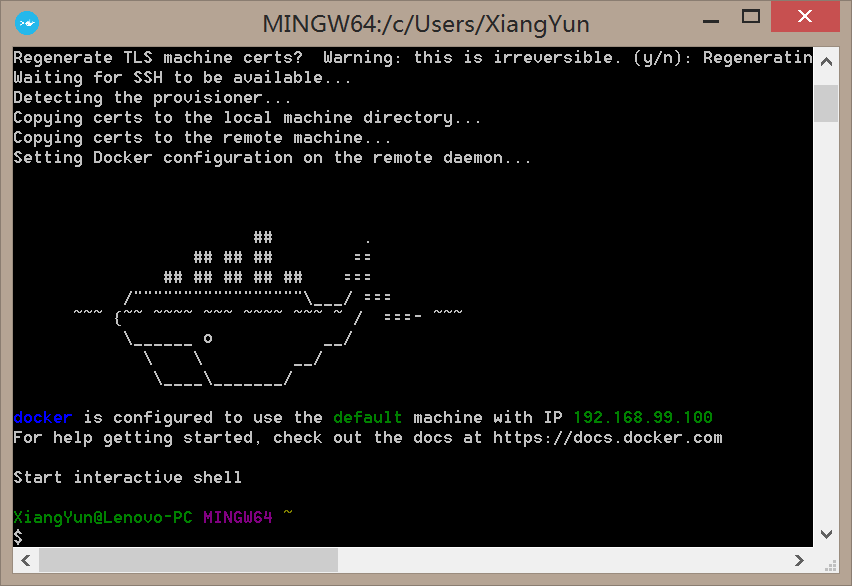
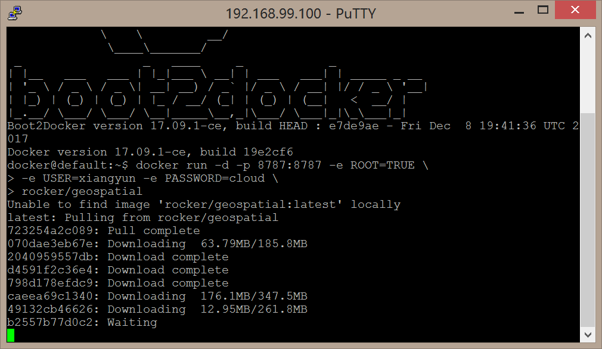
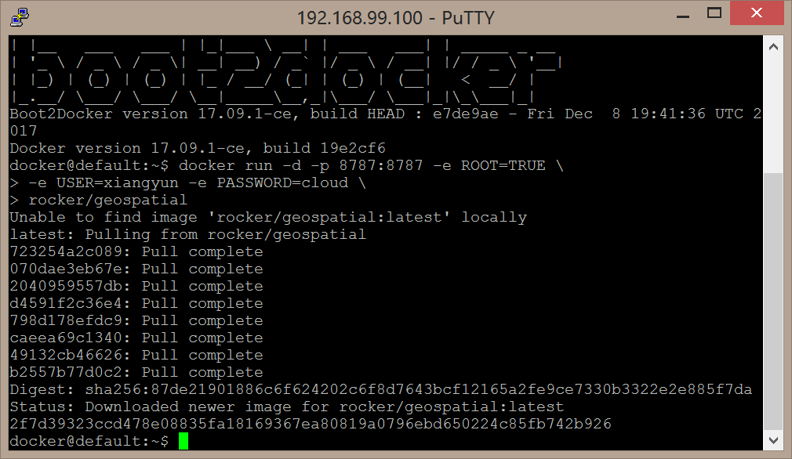
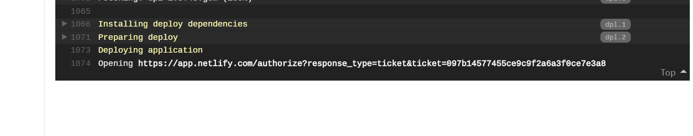

--- 
title: "挖掘机学校的论文模板"
author: "采煤专业"
date: "2018年6月12日"
site: bookdown::bookdown_site
documentclass: ctexbook
bibliography: [book.bib, packages.bib, articles.bib]
biblio-style: apalike
geometry: [a4paper, tmargin=3.0cm, bmargin=3.0cm, lmargin=3.0cm, rmargin=3.0cm]
link-citations: yes
description: "This is a minimal example of using the bookdown package to write a book. The output format for this example is bookdown::gitbook."
---

# 模板使用说明


本模板基于 bookdown 制作，得益于 pandoc^[<https://www.pandoc.org>]，有关如何在线发布书籍，请看文献 [@bookdown2016CRC] 第六章，以及 [@blogdown2017CRC] 第三章。

- 设置文武线
- 章节样式
- 参考文献位置
- 无序号的章节


在 `latex/before_body`添加

- 封面 
- 独创性声明
- 中英文摘要

或者目录前的部分单独制作成pdf，因为它们与后面的内容毫无关系，固定下来后，作为pdf文件合并

在 `latex/after_body` 添加

- 致谢
- 作者介绍

也可以同上的做法

## 软件信息

本文会用到比较多的空间数据分析的R包，故而拉取 `rocker/geospatial` 镜像，省却许多安装配置的麻烦，

```bash
docker run -d -p 8787:8787 -e ROOT=TRUE \
-e USER=xiangyun -e PASSWORD=cloud \
rocker/geospatial
```

安装依赖的中文 \TeX 包

```bash
tlmgr install ctex ms ulem xecjk environ trimspaces \
zhnumber fandol xltxtra realscripts
```

编译所依赖的R包

```{r}
sessionInfo()
```

docker 内完整的 R 包列表如下：

```{r}
list.files(.libPaths())
```

启动 docker 程序



拉取镜像








